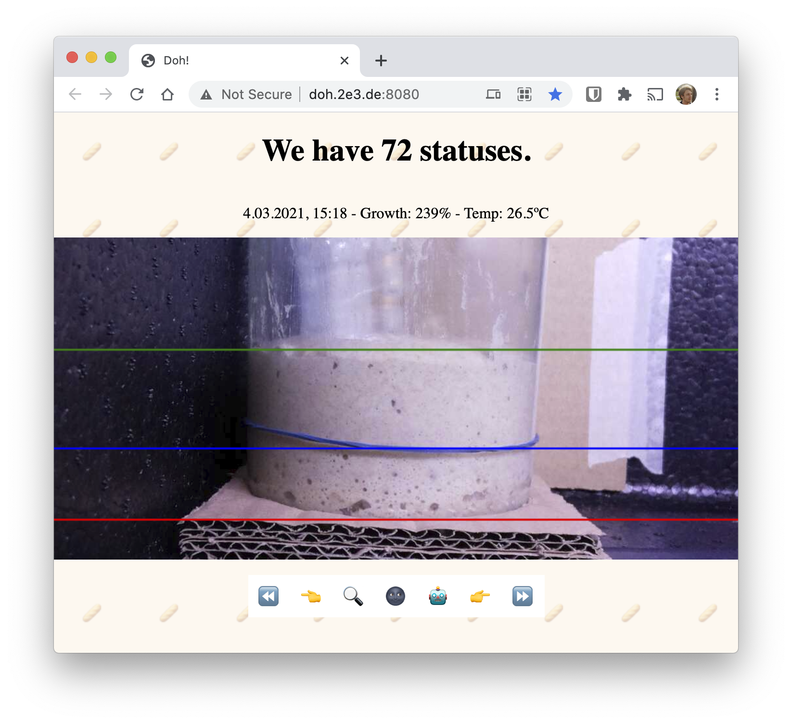

# Doh

A few softwares that measure the growth of my sourdough starter and alert me when I have to feed it. My attempt to use as many programming languages in one repo as possible.

I was working on this in 30-minute increments juggling a toddler and a pandemic, so don't expect too much polish – but rest assured I put my heart into it.

